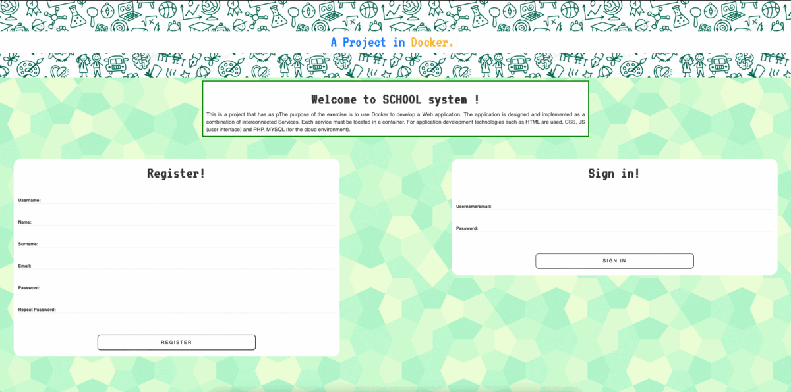
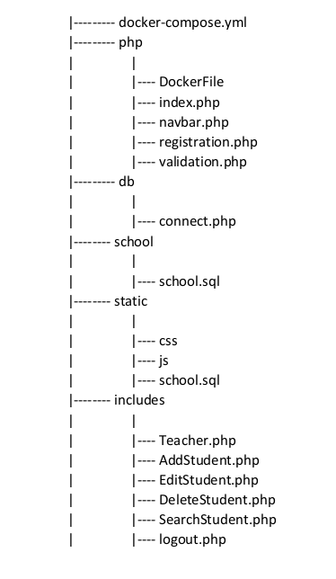

# Student App using php in Docker Environment


[](https://github.com/vvittis/StudentApp/blob/master/ezgif.com-gif-maker.gif)
The purpose of this exercise is to establish communication among different services with Docker from different containers.
The functionalities that the project offers are the above:
1. Users (Student, Teacher) Validation and Registration 
2. Edit, Add, Delete, Search Student by authorized Teachers

**_Note:_ The functionalities in php are fairly easy to do that's why there is not an extensive analysis on them**
## Services - Containers - Analysis of docker-compose.yml
### Php-Apache
This service is responsible for containing all .php files of the project. The name of this service is website.
In order to connect our entire project with the web(www) we use the php-apache volume (./php:/var/www/html).
The fact that this service depends on the connected database signifies that the database(mysqli) service
will start as soon as the website(php-apache) service will start.
In this service I do not use a ready to use container, but I constructed our own DockerFile inside the 
php folder. In the [DockerFile](php/Dockerfile) we download both php and MySQLi, and we expose the port 80 for internal communication.

```css
FROM php:7.3.3-apache
RUN apt-get update && apt-get upgrade -y
RUN docker-php-ext-install mysqli
EXPOSE 80 
```
So the exposed external port for accessing this service is 8000, and the website (php-apache)
communicates with mysqli via port 80.
```yaml
website: 
build:
  context: ./php
  dockerfile: Dockerfile
  ports:
    -'8080:80'
```
### MySQL
This service is responsible for managing the database system of the project. 
I use a ready-to-use image for [MYSQL:8.0](https://hub.docker.com/_/mysql) container from Docker Hub. 
Inside this service I have already created a database named school. This action serves that during the build of 
docker-compose up, the website will have an initialised database alongside  by grabbing the
[school.sql](php/school/school.sql) and making it the starting point of the database. This is made possible by adding 
a volume...
```yaml
volumes:
 - ./php/school:/docker-entrypoint-initdb.d
```
In order to have access in the database, I have to set variables for the environment of MySQLi.
These credentials can be found in the [docker-composed.yml](docker-compose.yml) in the service with the name of db.
The exposed port for accessing the service is 6033, and the respective internal port is 3306.
```yaml
db: 
  container_name: mysql8
  image: mysql:8.0
  command: --default-authentication-plugin=mysql_native_password
  ports:
    -'6033:3306'
```
Except the use of the volume responsible for the initialisation, there is the need for storing the new changes 
of data inside the database during use of the website, so I created an extra volume...
```yaml
volumes:
  - ./php/school/data:/var/lib/mysql
```
With this volume during the docker-compose up a new bind mount file is created on top of the initial database. 
### PhpMyAdmin
This service is optional but non the less necessary for visualization and better monitoring of the database.
It's exposed port is 8080 for accessing externally and port 80 for internal communication with the php as we discussed
previously. I used a ready-to-use image from Docker Hub [PhpMyAdmin](https://hub.docker.com/_/phpmyadmin).
```yaml
phpmyadmin:
  depends_on:
    - db
  image: phpmyadmin/phpmyadmin
  ports:
    -'8080:80'
```
## Requirements - Steps for use
First of all you have to have docker and docker-compose installed in your machine. To do that: ``` sudo apt install docker docker-compose```

Secondly, in the case you do ```docker image ls``` the following error will apear _"Got permission denied while
trying to connect to the Docker daemon socket at..."_, so in order to solve it you create a new group with all the previleges ```sudo usermod -aG docker $USER``` 

Lastly, you enter as a member of the new group with the following command. ```newgrp docker```
 
For running my project:
1. Clone the repo ```git clone https://github.com/vvittis/StudentApp.git```
2. Enter the directory ```cd website```
3. Run ```docker-compose up```
4. Visit the ``locahost:8000``

If you want to test the functionalities you can enter the system with the following credentials. ```username: vas & password:123```

## Project Structure

[

 
